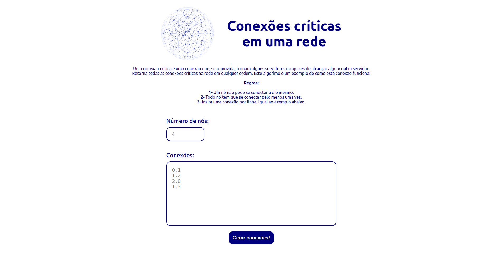
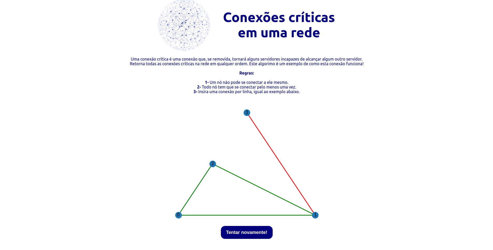

# Grafos2 - Conexões Críticas

**Conteúdo da Disciplina**: Grafos 2 

## Alunos
|Matrícula | Aluno |
| -- | -- |
| 15/0005563  |  André Lucas Ferreira |
| 17/0039803	  |  Lucas Medeiros |

## Sobre 

Uma demonstração das conexões críticas utilizando o algoritmo de busca em profundidade.

Link para o vídeo de apresentação: [Conexões Críticas]()

## Screenshots

## Instalação 
**Linguagem**: JavaScript, Python, HTML, CSS  
**Framework**: React  

## Instalação 

Para clonar o projeto digite:

    git clone https://github.com/projeto-de-algoritmos/Grafos2_Conexoes_Criticas

Depois rode o comando para executar o docker da aplicação:

    docker-compose up

Por fim, acesse a porta do frontend e aproveite:

    http://localhost:3000/

## Uso 

1. Abra o navegador web de sua escolha e digite a url do projeto; 
2. Selecione a quantidade de nós que deseja
3. Indique as conexões dos nós e clica no botão para gerar a rede de conexões.

## Outros 
Quaisquer outras informações sobre seu projeto podem ser descritas abaixo.

